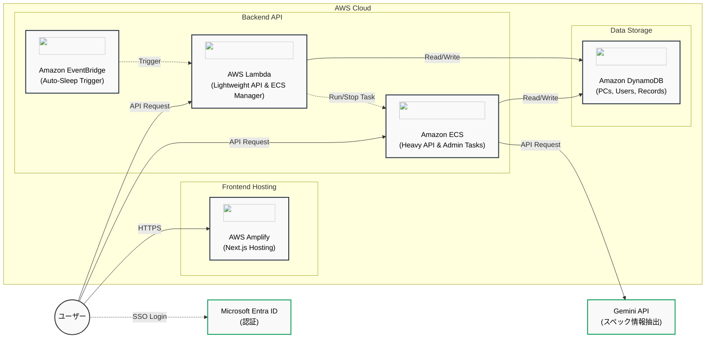

# システム構成図

AWS上で動作することを前提とした、PC管理台帳アプリのシステム構成図です。

## 構成要素の説明

1. **フロントエンド (AWS Amplify + Next.js)**
   - ユーザーがアクセスするWebアプリケーション（Next.js）をAWS Amplifyを利用してホスティングし、常時稼働で高速に配信します。ECS起動時のローディング表示などもフロントエンドでハンドリングします。
2. **バックエンド (AWS Lambda + Amazon ECS のハイブリッド構成)**
   - **AWS Lambda**: ログイン処理や軽量なAPIリクエストを処理します。また、フロントエンドからの要求に応じてECSを起動する役割、およびEventBridgeからの定期実行トリガーを受け、アイドル状態（最終アクティビティから2時間経過）のECSタスクを停止する役割（ECS Manager）を担います。
   - **Amazon ECS**: PC登録時におけるターミナル情報とGemini APIを活用したスペック情報のパース・抽出など、重い処理や管理者向けの処理を実行します。コスト最適化のため、必要な時だけ起動し、アイドル時には自動スリープ（停止）して課金を抑える仕組みになっています。
   - **Amazon EventBridge**: ECSの自動スリープ機能を実現するための定期実行トリガー（1時間ごと等）として機能し、Lambda（ECS Manager）を呼び出してタイムアウト判定を実行させます。
3. **データベース (Amazon DynamoDB)**
   - ユーザー情報、PC情報（管理番号、スペック、ステータスなど）、利用履歴、返却履歴などのデータを保存します。スケーラブルで柔軟なNoSQLデータストアとして機能し、最終アクティビティのタイムスタンプなども記録してECSの自動スリープ判定に利用します。
4. **認証 (Microsoft Entra ID)**
   - Microsoftアカウントでのログイン（シングルサインオン: SSO）を実現するため、Azure AD（Entra ID）と連携して認証を行います。なお、管理者/一般ユーザーの権限管理はシステム内（DynamoDB）で独自に行われます。
5. **外部API (Gemini API)**
   - PC登録時に、ユーザーがターミナルから取得した生のスペック情報をECSからGemini APIに送信し、必要なデータ項目（CPU、メモリ、ストレージ、OSバージョンなど）を自動で抽出・整形してデータベースに保存します。
