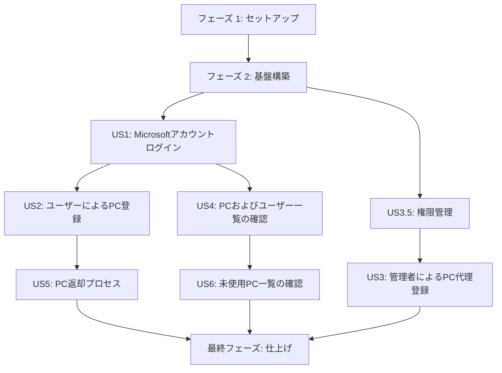

# 実装タスク: PC管理台帳

## 依存関係

## フェーズ 1: セットアップ

**目標**: プロジェクト構造とコアとなる依存関係を初期化する。

- [x] T001 `frontend/` にNext.jsプロジェクトを初期化する
- [x] T002 [P] `backend/lambda/` にPython環境とFastAPIをセットアップする
- [x] T003 [P] `backend/ecs/` にPython環境とFastAPIをセットアップする
- [ ] T004 [P] `infrastructure/` にAWS CDKプロジェクトを初期化する
- [ ] T005 [P] `docs/session-notes.md`、`docs/backlog.md`、`docs/troubleshooting.md`、`docs/ubiquitous-language.md` を作成し、初期化する

## フェーズ 2: 基盤構築

**目標**: 共有インフラストラクチャと基盤となるコンポーネントをセットアップする。

- [ ] T005 `infrastructure/stacks/database-stack.py` でDynamoDBテーブル (Users, PCs, ReturnRecords, PCUsageHistories) を定義する
- [ ] T006 `infrastructure/stacks/lambda-stack.py` でLambda関数のインフラを実装する
- [ ] T007 `infrastructure/stacks/ecs-stack.py` でECSクラスターとタスク定義を実装する
- [ ] T008 [P] `backend/lambda/src/db.py` で共有のDynamoDBクライアントを実装する
- [ ] T009 [P] `backend/ecs/src/db.py` で共有のDynamoDBクライアントを実装する

## フェーズ 3: Microsoftアカウントログイン [US1]

**目標**: ユーザーはMicrosoftアカウントを使用してシステムにログインし、適切な権限でアクセスできる。
**独立テスト**: Microsoftアカウントでのログインが成功し、ユーザーの権限に応じた画面が表示されることを確認する。

- [ ] T010 [US1] `frontend/src/app/api/auth/[...nextauth]/route.ts` でAzure ADプロバイダーを使用したnext-authを設定する
- [ ] T011 [US1] `frontend/src/app/login/page.tsx` でログインページのUIを実装する
- [ ] T012 [US1] `frontend/src/middleware.ts` で保護されたルート用の認証ミドルウェアを実装する
- [ ] T013 [US1] `backend/lambda/src/main.py` で認証APIエンドポイントを作成する
- [ ] T014 [US1] `backend/lambda/src/services/auth-service.py` でユーザー権限の検証ロジックを実装する

## フェーズ 4: 権限管理 [US3.5]

**目標**: システム内で管理者と一般ユーザーの権限を管理する。
**独立テスト**: テーブルの権限値を手動で変更し、その権限に応じたアクセス制御が機能することを確認する。

- [ ] T015 [US3.5] `backend/lambda/src/models/user.py` でUserモデルとリポジトリを作成する
- [ ] T016 [US3.5] `frontend/src/lib/rbac.ts` でロールベースのアクセス制御 (RBAC) ユーティリティを実装する
- [ ] T017 [US3.5] `frontend/src/app/api/auth/[...nextauth]/route.ts` で認証セッションにユーザー権限を含めるよう更新する

## フェーズ 5: ユーザーによるPC登録 [US2]

**目標**: 一般ユーザーは自分のPCをシステムに登録し、スペック情報を簡単に入力できる。
**独立テスト**: ユーザーがターミナルを起動した際にスペック取得コマンドが実行され、その結果がフォームに反映された後、Gemini APIによって整形されたデータが正しく登録され、適切な管理番号が付与されることを確認する。

- [ ] T018 [US2] `backend/ecs/src/models/pc.py` でPCモデルとリポジトリを実装する
- [ ] T019 [US2] `backend/ecs/src/services/gemini-service.py` でGemini API連携サービスを作成する
- [ ] T020 [US2] `backend/ecs/src/main.py` でスペック解析エンドポイント `/api/pcs/parse-specs` を実装する
- [ ] T021 [US2] `backend/ecs/src/main.py` でPC登録エンドポイント `/api/pcs` を実装する
- [ ] T022 [US2] `backend/ecs/src/services/pc-service.py` で自動採番ロジック (N-XXX, D-XXX) を実装する
- [ ] T023 [US2] `frontend/src/app/pcs/register/page.tsx` でPC登録フォームのUIを作成する
- [ ] T024 [US2] `frontend/src/components/terminal-command.tsx` でターミナルコマンドの生成とクリップボードへのコピー機能を実装する
- [ ] T025 [US2] `frontend/src/services/pc-api.ts` でフロントエンドのフォームとparse-specsおよび登録APIを統合する

## フェーズ 6: 管理者によるPC代理登録 [US3]

**目標**: 管理者は特定のユーザーを指定して、そのユーザーの代理としてPCを登録できる。
**独立テスト**: 管理者がユーザーを選択し、PC情報を登録した結果が、選択したユーザーのPCとして正しく紐づき、管理番号が付与されることを確認する。

- [ ] T026 [US3] `backend/ecs/src/main.py` で管理者ドロップダウン用のユーザー一覧エンドポイントを実装する
- [ ] T027 [US3] `backend/ecs/src/main.py` で管理者がownerIdを指定できるようにPC登録エンドポイントを更新する
- [ ] T028 [US3] `frontend/src/app/pcs/register/page.tsx` で管理者向けのPC登録フォームにユーザー選択ドロップダウンを追加する

## フェーズ 7: PCおよびユーザー一覧の確認 [US4]

**目標**: 管理者はシステムに登録されているすべてのPC一覧とユーザー一覧を確認できる。
**独立テスト**: 管理者権限でアクセスした際に、全PCと全ユーザーのリストが正しく表示されることを確認する。

- [ ] T029 [US4] `backend/ecs/src/main.py` でPC一覧エンドポイント `/api/pcs` を実装する
- [ ] T030 [US4] `frontend/src/app/pcs/page.tsx` でPC一覧ページのUIを作成する
- [ ] T031 [US4] `frontend/src/app/pcs/page.tsx` でCSVダウンロード機能を実装する
- [ ] T032 [US4] `frontend/src/app/globals.css` でPC向けのレイアウトに対応したレスポンシブデザインを確保する

## フェーズ 8: PC返却プロセス [US5]

**目標**: ユーザーは不要になったPCを返却するためのフォームを送信できる。
**独立テスト**: ユーザーが返却日、返却理由、PCの状態を入力して送信し、PCのステータスが更新されることを確認する。

- [ ] T033 [US5] `backend/ecs/src/models/return-record.py` でReturnRecordモデルとリポジトリを実装する
- [ ] T034 [US5] `backend/ecs/src/main.py` でPC返却エンドポイント `/api/pcs/{pcId}/return` を実装する
- [ ] T035 [US5] `frontend/src/app/pcs/[pcId]/return/page.tsx` でPC返却フォームのUIを作成する
- [ ] T036 [US5] `backend/ecs/src/services/pc-service.py` でPCのステータス遷移ロジックを更新する

## フェーズ 9: 未使用PC一覧の確認 [US6]

**目標**: ユーザー（および管理者）は、現在誰にも割り当てられていない未使用のPC一覧を確認できる。
**独立テスト**: 未使用PC一覧画面にアクセスし、ステータスが「未使用」のPCのみが表示されることを確認する。

- [ ] T037 [US6] `backend/ecs/src/main.py` でステータスによるフィルタリングをサポートするようにPC一覧エンドポイントを更新する
- [ ] T038 [US6] `frontend/src/app/pcs/unused/page.tsx` で未使用PC一覧のビュー/タブを作成する

## 最終フェーズ: 仕上げ

**目標**: 横断的な関心事、最終テスト、デプロイの準備。

- [ ] T039 `backend/lambda/src/services/ecs-manager.py` でLambda経由のECS自動スリープおよび起動ロジックを実装する
- [ ] T040 `frontend/src/components/ecs-loading-state.tsx` でECSコールドスタート時にフロントエンドに「loading...」UIを追加する
- [ ] T041 `scripts/migrate-excel-data.py` で既存のExcelデータ用のデータ移行スクリプトを作成する
- [ ] T042 最終的なエンドツーエンドテストとバグ修正
